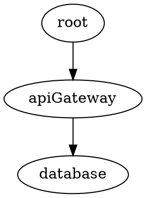

# Part A: Installing and Setting Up ibis

_Free, open-source. This is a standalone guide for anyone adopting ibis.
Enterprise workshop available separately — contact for details._

---

## What ibis is

ibis is a graph-driven coordination framework for human + AI development
teams. It gives your project:

- A **system map** (GRAPH.dot) where every node is executable
- **Health checks** that run on a 2-min timer
- A **message bus** (.notify/) with sub-second delivery
- **Session handoffs** (HANDOFF.md) that survive context resets
- **Leases** so two workers don't edit the same thing
- **A ledger** for measurements that prove work across sessions
- **Git hooks** that enforce coordination discipline

Zero dependencies beyond bash, python3, and git.

---

## Before you start: the landscape

If you're new to AI-assisted development, this section explains where ibis
fits in the evolution of how developers work with AI — and the cost and
risk tradeoffs that make a coordination layer necessary.

### The evolution: prompts → agents → multi-agents → skill files → graphs

The tooling has moved fast. Understanding where you are on this ladder
matters because each step up trades direct control for throughput:

**1. Prompt engineering** (2023-2024). You write a prompt, the model
returns text. You copy-paste the result. The human is in the loop on
every action. Low risk, low throughput.

**2. Agents** (2024-2025). Claude Code, Cursor, Codex. The model reads
your files, writes code, runs commands. The human reviews diffs. Higher
throughput, but the agent can now *do things* — edit files, run tests,
install packages. The blast radius of a mistake is larger.

**3. Multi-agent** (2025-2026). Multiple sessions working the same repo
in parallel. One agent builds the API while another builds the frontend.
Throughput multiplies — but so do coordination failures: two agents edit
the same file, one agent's work depends on another's uncommitted changes,
context is lost between sessions.

**4. Skill files** (2025-present). `.md` files that encode reusable
instructions — CLAUDE.md project rules, custom slash commands, workflow
templates. The developer writes the *method*, not the *implementation*.
This is where the developer becomes a manager: defining process, not
writing code.

**5. Graphs with agents** (2026-present). Agent orchestration frameworks
(Microsoft Agent Framework, LangGraph, CrewAI) where a graph defines
which agents run in what order. **Important distinction**: these are
designed for business process automation — routing emails, processing
documents, managing spreadsheets across corporate systems. They are NOT
designed for coding. For coding, the graph should be a *coordination
layer* (what ibis is) that bounds what agents can do, not an execution
graph that chains agents together.

The ZS Associates finding (see [Overview](presentation-overview.md)) is
definitive here: multi-agent pipelines for coding produce "locally correct,
globally incoherent" results. One reasoning agent bounded by a graph
outperforms a pipeline of specialized agents.

**Where ibis fits**: ibis is a coordination layer at level 3-4. It doesn't
orchestrate agents — it gives them a shared map, a message bus, and
discipline hooks so they can work the same repo without colliding. The
graph bounds what they're *allowed* to investigate, not what order they
run in.

### MCP: use only for narrow tasks with good ground truths

MCP (Model Context Protocol) lets agents call tools — read databases,
query APIs, run commands. It's powerful and expensive.

**The cost problem**: every MCP tool call costs tokens. An agent with
broad MCP access burns through context exploring tools it doesn't need.
Anthropic's own measurement: agents use ~4x as many tokens as chat,
and multi-agent systems use ~15x as many tokens as chat.

**When MCP makes sense**:
- Narrow, well-defined tasks: "check this node's health," "record this
  measurement," "list active leases"
- Good ground truths: the tool returns structured data the agent can
  verify (a health check exit code, a ledger value, a lease expiry time)
- Read-only by default: `ibis mcp --read-only` for monitoring agents

**When MCP doesn't make sense**:
- Broad exploration: "find all the bugs in this codebase"
- No ground truth: "is this code good?" (the agent can't verify its own
  judgment via a tool call)
- High-frequency polling: tools called every turn instead of once

ibis's MCP server is deliberately narrow: 8 read tools, 4 write tools,
structured output. An agent connected to ibis via MCP spends tokens on
coordination, not exploration.

### Agentic loops: the danger of access and low supervision

An agentic loop is an agent that runs autonomously — reading files,
writing code, running tests, fixing errors, repeating. The loop continues
until the agent decides it's done or hits a limit.

**The danger is compound**:

- **Cost compounds**: a failure at step 15 triggers a retry that carries
  the full 15-step history. Each retry is more expensive than the last.
  Anthropic's data: reflexive self-verification costs ~2.3x baseline.
  A single orchestrator error produces a 2-3x cost multiplier.
- **Access compounds**: an agent with shell access can `rm -rf`, drop
  tables, force-push, kill processes. It will do these things not out of
  malice but because it "thinks" that's the fastest path to making the
  test pass.
- **Supervision degrades**: the longer the loop runs, the less the
  developer reviews each step. Turn 1 gets careful review. Turn 40 gets
  a glance. This is when the worst bugs ship.

**Guardrails for loops**:
- Permission allowlists (`settings.json deny`) — hard enforcement
- Notify-before-commit discipline (`ibis hook install` with
  `require_notify=true`) — forces the agent to describe what it's about
  to do before doing it
- Ledger measurements — the agent must *prove* the fix, not just claim it
- Session time limits — don't let a session run for 4 hours unsupervised

### AI PR reviews: fresh sessions, model bias, and what actually works

Can AI review its own PRs? The data says: partially, with caveats.

**The self-preference problem**: LLMs demonstrably favor their own
output during self-review. They recognize their own patterns and
exhibit measurable self-preference bias. A model reviewing code it
generated in the same session is *less reliable* than a fresh session.

**What the independent benchmarks show** (Entelligence.ai, 67 production
bugs across 5 real repos — Cal.com, Grafana, Sentry, Keycloak, Discourse):

| Tool | F1 | Recall | Precision |
|---|---|---|---|
| Entelligence | 47.2% | 44.8% | 50.0% |
| Codex | 45.4% | 40.3% | 51.9% |
| Claude (direct) | 42.8% | 43.3% | 42.3% |
| CodeRabbit | 33.0% | 49.2% | 24.8% |
| Copilot | 22.6% | 34.3% | 16.8% |

Note: CodeRabbit self-reports 51.5% F1 on their own benchmark. The
independent number is 33.0% — with high recall (finds things) but very
low precision (75% of comments are noise).

**Is a fresh Opus 4.6 session equal to adversarial review?**

Not quite. Augment Code's research on adversarial code review found
five dimensions that separate effective review from rubber-stamping:

1. **Context**: fresh session (no history of writing the code)
2. **System prompt**: skeptical framing ("find flaws") vs neutral
3. **Model**: ideally a different model family catches different blind spots
4. **Tools**: read-only (reviewer can't "fix" things to make them pass)
5. **Output format**: structured verdict (PASS/FAIL with evidence)

A fresh Opus 4.6 session scores well on dimension 1 (fresh context) and
can be configured for 2 and 4. But it's the *same model family* — it
shares the same training biases. Augment Code's libfuse campaign found
that "a Codex agent found bugs that Claude-family review missed."

**Practical recommendation**: a fresh Opus 4.6 session with a skeptical
system prompt is *good* — better than same-session review, better than
no review. It's not *as good as* cross-model review, but cross-model
review costs 2x (two API calls). For most teams, fresh same-model review
is the right tradeoff.

### Model ROI: is Opus 4.6 the best value for coding?

Current pricing (per million tokens, Anthropic official):

| Model | Input | Output | SWE-bench Verified |
|---|---|---|---|
| Haiku 4.5 | $1 | $5 | 73.3% |
| Sonnet 5 | $2 | $10 | 82-85% |
| Sonnet 4.6 | $3 | $15 | 79.6% |
| Opus 4.5-5 | $5 | $25 | 80.8-88.6% (varies by version) |
| Fable 5 | $10 | $50 | 95.0% |

Cost per SWE-bench-Verified percentage point (output tokens):

| Model | $/point |
|---|---|
| Haiku 4.5 | $0.07 |
| Sonnet 5 | $0.12 |
| Sonnet 4.6 | $0.19 |
| Opus 4.6 | $0.31 |
| Fable 5 | $0.53 |

**On pure benchmark ROI, Sonnet 5 wins.** It scores higher than Opus 4.6
on SWE-bench Verified (82-85% vs 80.8%) at 60% lower output cost. Haiku
4.5 is the cheapest per point but misses more.

**But benchmarks aren't the whole story.** Opus 4.6's advantages don't
show up on SWE-bench:

- **Instruction following**: Opus models follow complex CLAUDE.md rules
  more reliably than Sonnet. For ibis workflows (DFS traversal, notify
  discipline, commit-as-you-go), this matters more than raw coding speed.
- **Extended reasoning**: harder architectural decisions, multi-file
  refactors, security review — tasks where thinking depth matters more
  than code generation speed.
- **Consistency across long sessions**: Sonnet drifts more on long
  conversations. Opus holds context better through 50+ turns.
- **All Opus versions are the same price**: 4.5 through 5 are all $5/$25.
  If you're paying for Opus, use the latest (Opus 5, 88.6% SWE-bench).

**The honest answer**: Opus 4.6 is not the best ROI for *coding tasks
measured by benchmarks*. Sonnet 5 is. But for *managed AI workflows* —
where the agent needs to follow rules, maintain discipline, and make
judgment calls — Opus's instruction-following advantage may justify the
2.5x cost premium over Sonnet 5. The right strategy is to route: Sonnet 5
for straightforward implementation, Opus for review and complex tasks,
Fable for genuinely hard problems only.

> **Note for Part B attendees**: the enterprise workshop covers model
> selection strategy in Module 2 (Implement → Test). The data above is
> the starting point; your team's actual ROI depends on task mix.

---

## Step 1: Install ibis

### macOS / Linux / WSL

```sh
git clone https://github.com/HBDunn/blackswan-ibis ~/.ibis-cli
~/.ibis-cli/install.sh
ibis version
```

### Windows (Git Bash)

```powershell
git clone https://github.com/HBDunn/blackswan-ibis $env:USERPROFILE\.ibis-cli
& $env:USERPROFILE\.ibis-cli\install.ps1
# then from Git Bash:
ibis version
```

### Requirements

- `bash` >= 4 (macOS ships 3.2 — `brew install bash`)
- `python3` (or `python`)
- `git`

That's it. No npm, no pip install, no Docker.

---

## Step 2: Initialize your project

```sh
cd your-project
ibis init --adopt --name myproject
```

This:
1. Scans your repo for services (docker-compose, Dockerfiles, package.json,
   GitHub workflows, systemd units)
2. Creates `.ibis/GRAPH.dot` with auto-discovered nodes
3. Creates doc stubs (`.ibis/docs/<node>.md`) for each node
4. Creates test stubs (`tests/ibis/<node>.sh`) for each node
5. Installs a 2-min health check timer (systemd/launchd/Task Scheduler/cron)
6. Installs an instant-drain file watcher for sub-second message delivery
7. Creates the first `HANDOFF.md` with health check results

### What you get

```
your-project/
├── .ibis/
│   ├── GRAPH.dot          # the system map (source of truth)
│   ├── config             # project name, settings
│   ├── .notify/           # fire-and-forget message bus
│   ├── .leases/           # worker claims
│   ├── ledger/            # measurements per node
│   └── docs/<node>.md     # one required doc per node
├── tests/ibis/<node>.sh   # one required test per node
└── HANDOFF.md             # live status + inbox (auto-written)
```

---

## Step 3: Understand the graph

Every node in GRAPH.dot is a unit of your system with a contract:



### Node attributes — the operational contract

| Attribute | Purpose | Example |
|---|---|---|
| `check=` | Liveness probe — exit 0 = healthy | `curl -fsS localhost:8080/healthz` |
| `check2=`, `check3=` | Additional health dimensions | `curl localhost:8080/metrics \| grep up` |
| `doc=` | Path to the canonical documentation | `.ibis/docs/api-gateway.md` |
| `test=` | Path to the behavioral test | `tests/ibis/api-gateway.sh` |
| `restart=` | How to remediate a failure | `docker compose restart api` |
| `deploy=` | How to deploy a new version | `./scripts/deploy-api.sh` |
| `poll="fast"` | Run this check on the 2-min timer | (else on-demand only) |
| `todo=` | Active work item for this node | `OPEN: migrate to v2 schema` |

### The three required attributes

Every node must have `check=`, `doc=`, and `test=`. `ibis doctor` enforces
this as a CI gate. Without all three, the node doesn't count.

- **check** = "Is it alive right now?" (fast, cheap, every 2 minutes)
- **doc** = "What is it and how does it work?" (human + AI readable)
- **test** = "Does it actually do the right thing?" (behavioral, in CI)

### Build, restart, deploy, recover

These are the operational attributes that turn a static map into a runbook:

**build** — How to build the component from source:
```dot
frontend [
  check="curl -fsS localhost:3000",
  doc=".ibis/docs/frontend.md",
  test="tests/ibis/frontend.sh",
  build="npm ci && npm run build",
  deploy="rsync -a dist/ server:/var/www/",
  restart="systemctl --user restart frontend"
];
```

**restart** — How to recover from a failure:
```sh
# ibis status shows FAIL on apiGateway
# Read the node's restart= attribute:
grep 'restart=' .ibis/GRAPH.dot | grep apiGateway
# → restart="docker compose restart api"
# Run it:
docker compose restart api
# Verify:
ibis status
```

**deploy** — How to ship a new version:
```sh
# The deploy= attribute is the canonical deploy procedure
# No improvising — the graph says how to deploy
grep 'deploy=' .ibis/GRAPH.dot | grep database
# → deploy="./scripts/migrate.sh"
./scripts/migrate.sh
ibis ledger database 99.5 "after migration"
```

**recover** — The RECOVERY.md workflow:
```markdown
## Incident: API returning 500s on /auth

**Symptom**: check= failing for authService node
**Root cause**: Redis connection pool exhausted after deploy
**Fix**: Increase pool size in config, restart
**Verification**: ibis ledger authService 99.8 "after pool fix"
**Prevention**: Added check2= for Redis connection count
**Commit**: a1b2c3d
```

---

## Step 4: Set up your AI agent

`ibis init` generates a `CLAUDE.md` from a template. This file IS the
user manual — for the agent, not the human. It teaches the agent three
things:

### Before touching any node

```sh
ibis node gateway --context
```

One command returns everything the agent needs (~50-100 lines):
- Node definition with all attributes
- Incoming and outgoing edges
- Doc summary (first 30 lines)
- RECOVERY.md entries mentioning this node
- PRIORITIES.md entries mentioning this node
- HANDOFF.md entries (what's broken, what's in the inbox)
- Last 5 ledger measurements
- Active leases (is someone else working on this?)

This replaces reading 4-5 separate files. Fewer tokens, no steps to skip.

### Before committing

```sh
ibis notify "fixed the gateway timeout — increased pool size to 20"
```

The pre-commit hook blocks the commit if notify wasn't called. The agent
must describe what it did before it can commit.

### After fixing something

```sh
ibis ledger gateway 200 "response time ms after pool fix"
```

A measurement, not a claim. The ledger is append-only.

The human's job: review diffs and approve commits. The agent follows
the CLAUDE.md rules. The hooks make violations impossible.

---

## Step 5: Hooks and enforcement

`ibis init` installs git hooks automatically. Three hooks enforce the
workflow mechanically:

1. **pre-commit** — blocks commits if `ibis notify` wasn't called recently
2. **post-commit** — auto-notifies with commit hash + subject + files
3. **commit-msg** — warns if fix-language commit has no doc update staged

The hooks are the reason agents follow the rules. Without them, CLAUDE.md
is advisory — the agent might skip steps. With them, skipping is a blocked
commit.

### Optional: PreToolUse hooks (Claude Code)

For even stronger enforcement, Claude Code supports PreToolUse hooks that
block violations *before* the agent can act:

- Block flat GRAPH.dot reads (force `ibis node --context` instead)
- Block unenforced SSH (require pre-ssh-check first)

These are configured in `~/.claude/settings.json`. See the ibis docs for
the hook configuration.

---

## Step 6: Use leases for multi-worker coordination

```sh
export IBIS_WORKER=claude-main
ibis claim database --ttl 3600    # "I'm working on the database node"
# ... do the work ...
ibis release database             # done
```

Other workers that try to claim the same node get refused with a clear
message: who holds it, when it expires.

---

## Step 7: Measure with the ledger

```sh
ibis ledger api-gateway 99.2 "uptime after retry fix"
ibis ledger api-gateway 98.7 "dipped after deploy"
ibis ledger api-gateway 99.8 "stable after rollback"
```

"Fixed" means "measured and recorded," not "the probe passed once."

---

## Step 8: Add ibis to CI

```yaml
# .github/workflows/ibis.yml
name: ibis
on: [push, pull_request]
jobs:
  check:
    runs-on: ubuntu-latest
    steps:
      - uses: actions/checkout@v4
      - run: |
          git clone --depth 1 https://github.com/HBDunn/blackswan-ibis ~/.ibis-cli
          ~/.ibis-cli/install.sh && echo "$HOME/.local/bin" >> "$GITHUB_PATH"
      - run: ibis doctor --strict   # structure
      - run: ibis validate          # references
      - run: ibis audit             # honesty
```

---

## Step 9: Coordinate multiple repos (hub mode)

```sh
mkdir ~/work/coord && cd ~/work/coord
ibis hub init
ibis hub add ~/work/api
ibis hub add ~/work/web
ibis hub poll          # one HANDOFF across all repos
```

---

## Step 10: Session handoff

Before closing a session, write SESSION.md:

```markdown
# Session — 2026-08-13

## What I was working on
Migrating the payment gateway to v2 API.

## What I changed
- Updated schema in migrations/042_v2.sql
- Fixed rate limiter threshold (was 100, now 500)

## What's unfinished
- Load test not run yet (need staging environment)

## What I learned
- The v1 endpoint can't be removed until mobile app v3.2 ships
```

---

## Step 11: Visualize the graph

```sh
ibis render --open    # interactive WASM viewer in browser (no graphviz needed)
```

Or use graphviz directly:
```sh
dot -Tsvg .ibis/GRAPH.dot -o graph.svg
```

Agents use `ibis node <name> --context` for DFS lookup — they never read
the graph flat or render it.

---

## Verify your setup

Run the full gate:
```sh
ibis status           # all health checks pass?
ibis doctor --strict  # every node has check + doc + test?
ibis validate         # all doc=, paths=, test= resolve?
ibis audit            # docs are fresh, assertions pass?
```

All four green = ibis is working.
