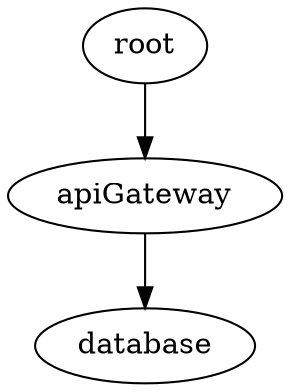

# Part A: Installing and Setting Up ibis

_Free, open-source. A standalone install and setup guide — mechanics only.
For how to *work with* AI (delegation, supervision, review, verifying claims),
see the enterprise workshop; contact for details._

---

## What ibis is

ibis is a graph-driven coordination framework for human + AI development
teams. It gives your project:

- A **system map** (GRAPH.dot) where every node is executable
- **Health checks** that run on a 2-min timer
- A **message bus** (.notify/) with sub-second delivery
- **Session handoffs** (HANDOFF.md) that survive context resets
- **Leases** so two workers don't edit the same thing
- **A ledger** for measurements that prove work across sessions
- **Git hooks** that enforce coordination discipline

Zero dependencies beyond bash, python3, and git.

---

## Step 1: Install ibis

### macOS / Linux / WSL

```sh
git clone https://github.com/HBDunn/blackswan-ibis ~/.ibis-cli
~/.ibis-cli/install.sh
ibis version
```

### Windows (Git Bash)

```powershell
git clone https://github.com/HBDunn/blackswan-ibis $env:USERPROFILE\.ibis-cli
& $env:USERPROFILE\.ibis-cli\install.ps1
# then from Git Bash:
ibis version
```

### Requirements

- `bash` >= 4 (macOS ships 3.2 — `brew install bash`)
- `python3` (or `python`)
- `git`

That's it. No npm, no pip install, no Docker.

---

## Step 2: Initialize your project

```sh
cd your-project
ibis init --adopt --name myproject
```

This:
1. Scans your repo for services (docker-compose, Dockerfiles, package.json,
   GitHub workflows, systemd units)
2. Creates `.ibis/GRAPH.dot` with auto-discovered nodes
3. Creates doc stubs (`.ibis/docs/<node>.md`) for each node
4. Creates test stubs (`tests/ibis/<node>.sh`) for each node
5. Installs a 2-min health check timer (systemd/launchd/Task Scheduler/cron)
6. Installs an instant-drain file watcher for sub-second message delivery
7. Creates the first `HANDOFF.md` with health check results

### What you get

```
your-project/
├── .ibis/
│   ├── GRAPH.dot          # the system map (source of truth)
│   ├── config             # project name, settings
│   ├── .notify/           # fire-and-forget message bus
│   ├── .leases/           # worker claims
│   ├── ledger/            # measurements per node
│   └── docs/<node>.md     # one required doc per node
├── tests/ibis/<node>.sh   # one required test per node
└── HANDOFF.md             # live status + inbox (auto-written)
```

---

## Step 3: Understand the graph

Every node in GRAPH.dot is a unit of your system with a contract:



### Node attributes — the operational contract

| Attribute | Purpose | Example |
|---|---|---|
| `check=` | Liveness probe — exit 0 = healthy | `curl -fsS localhost:8080/healthz` |
| `check2=`, `check3=` | Additional health dimensions | `curl localhost:8080/metrics \| grep up` |
| `doc=` | Path to the canonical documentation | `.ibis/docs/api-gateway.md` |
| `test=` | Path to the behavioral test | `tests/ibis/api-gateway.sh` |
| `restart=` | How to remediate a failure | `docker compose restart api` |
| `deploy=` | How to deploy a new version | `./scripts/deploy-api.sh` |
| `poll="fast"` | Run this check on the 2-min timer | (else on-demand only) |
| `todo=` | Active work item for this node | `OPEN: migrate to v2 schema` |
| `invariant=` | Design decision that must not be silently reverted — **blocks** commits touching this node | `/tmp is tmpfs, not a bind-mount` |

### The three required attributes

Every node must have `check=`, `doc=`, and `test=`. `ibis doctor` enforces
this as a CI gate. Without all three, the node doesn't count.

- **check** = "Is it alive right now?" (fast, cheap, every 2 minutes)
- **doc** = "What is it and how does it work?" (human + AI readable)
- **test** = "Does it actually do the right thing?" (behavioral, in CI)

### Build, restart, deploy, recover

These are the operational attributes that turn a static map into a runbook:

**build** — How to build the component from source:
```dot
frontend [
  check="curl -fsS localhost:3000",
  doc=".ibis/docs/frontend.md",
  test="tests/ibis/frontend.sh",
  build="npm ci && npm run build",
  deploy="rsync -a dist/ server:/var/www/",
  restart="systemctl --user restart frontend"
];
```

**restart** — How to recover from a failure:
```sh
# ibis status shows FAIL on apiGateway
# Read the node's restart= attribute:
grep 'restart=' .ibis/GRAPH.dot | grep apiGateway
# → restart="docker compose restart api"
# Run it:
docker compose restart api
# Verify:
ibis status
```

**deploy** — How to ship a new version:
```sh
# The deploy= attribute is the canonical deploy procedure
# No improvising — the graph says how to deploy
grep 'deploy=' .ibis/GRAPH.dot | grep database
# → deploy="./scripts/migrate.sh"
./scripts/migrate.sh
ibis ledger database 99.5 "after migration"
```

**recover** — The RECOVERY.md workflow:
```markdown
## Incident: API returning 500s on /auth

**Symptom**: check= failing for authService node
**Root cause**: Redis connection pool exhausted after deploy
**Fix**: Increase pool size in config, restart
**Verification**: ibis ledger authService 99.8 "after pool fix"
**Prevention**: Added check2= for Redis connection count
**Commit**: a1b2c3d
```

---

## Step 4: Set up your AI agent

`ibis init` generates a `CLAUDE.md` from a template. This file IS the
user manual — for the agent, not the human. It teaches the agent three
things:

### Before touching any node

```sh
ibis node gateway --context
```

One command returns everything the agent needs (~50-100 lines):
- Node definition with all attributes
- Incoming and outgoing edges
- Doc summary (first 30 lines)
- RECOVERY.md entries mentioning this node
- PRIORITIES.md entries mentioning this node
- HANDOFF.md entries (what's broken, what's in the inbox)
- Last 5 ledger measurements
- Active leases (is someone else working on this?)

This replaces reading 4-5 separate files. Fewer tokens, no steps to skip.

### Before committing

```sh
ibis notify "fixed the gateway timeout — increased pool size to 20"
```

The pre-commit hook blocks the commit if notify wasn't called. The agent
must describe what it did before it can commit.

### After fixing something

```sh
ibis ledger gateway 200 "response time ms after pool fix"
```

A measurement, not a claim. The ledger is append-only.

The human's job: review diffs and approve commits. The agent follows
the CLAUDE.md rules. The hooks make violations impossible.

---

## Step 5: Hooks and enforcement

`ibis init` installs git hooks automatically. They are written to
`.ibis/githooks/` and activated with `core.hooksPath` — **not** copied into
`.git/hooks/`, which git does not track. An untracked hook is a protection
that vanishes on a fresh clone while the docs still claim it is active, and
whose removal never shows up in a diff. Commit `.ibis/githooks/` so the
protection travels with the repo.

Three hooks enforce the workflow mechanically:

1. **pre-commit** — blocks commits that touch a node declaring `invariant=`
   (always on; acknowledge with `IBIS_ACK=1` after reading it), then blocks
   if `ibis notify` wasn't called recently (opt-in via `require_notify=true`)
2. **post-commit** — auto-notifies with commit hash + subject + files
3. **commit-msg** — warns if fix-language commit has no doc update staged

The hooks are the reason agents follow the rules. Without them, CLAUDE.md
is advisory — the agent might skip steps. With them, skipping is a blocked
commit.

### Optional: PreToolUse hooks (Claude Code)

For even stronger enforcement, Claude Code supports PreToolUse hooks that
block violations *before* the agent can act:

- Block flat GRAPH.dot reads (force `ibis node --context` instead)
- Block unenforced SSH (require pre-ssh-check first)

These are configured in `~/.claude/settings.json`. See the ibis docs for
the hook configuration.

---

## Step 6: Use leases for multi-worker coordination

```sh
export IBIS_WORKER=claude-main
ibis claim database --ttl 3600    # "I'm working on the database node"
# ... do the work ...
ibis release database             # done
```

Other workers that try to claim the same node get refused with a clear
message: who holds it, when it expires.

---

## Step 7: Measure with the ledger

```sh
ibis ledger api-gateway 99.2 "uptime after retry fix"
ibis ledger api-gateway 98.7 "dipped after deploy"
ibis ledger api-gateway 99.8 "stable after rollback"
```

"Fixed" means "measured and recorded," not "the probe passed once."

---

## Step 8: Add ibis to CI

```yaml
# .github/workflows/ibis.yml
name: ibis
on: [push, pull_request]
jobs:
  check:
    runs-on: ubuntu-latest
    steps:
      - uses: actions/checkout@v4
      - run: |
          git clone --depth 1 https://github.com/HBDunn/blackswan-ibis ~/.ibis-cli
          ~/.ibis-cli/install.sh && echo "$HOME/.local/bin" >> "$GITHUB_PATH"
      - run: ibis doctor --strict   # structure
      - run: ibis validate          # references
      - run: ibis audit             # honesty
```

---

## Step 9: Coordinate multiple repos (hub mode)

```sh
mkdir ~/work/coord && cd ~/work/coord
ibis hub init
ibis hub add ~/work/api
ibis hub add ~/work/web
ibis hub poll          # one HANDOFF across all repos
```

---

## Step 10: Session handoff

Before closing a session, write SESSION.md:

```markdown
# Session — 2026-08-13

## What I was working on
Migrating the payment gateway to v2 API.

## What I changed
- Updated schema in migrations/042_v2.sql
- Fixed rate limiter threshold (was 100, now 500)

## What's unfinished
- Load test not run yet (need staging environment)

## What I learned
- The v1 endpoint can't be removed until mobile app v3.2 ships
```

---

## Step 11: Visualize the graph

```sh
ibis render --open    # interactive WASM viewer in browser (no graphviz needed)
```

Or use graphviz directly:
```sh
dot -Tsvg .ibis/GRAPH.dot -o graph.svg
```

Agents use `ibis node <name> --context` for DFS lookup — they never read
the graph flat or render it.

---

## Verify your setup

Run the full gate:
```sh
ibis status           # all health checks pass?
ibis doctor --strict  # every node has check + doc + test?
ibis validate         # all doc=, paths=, test= resolve?
ibis audit            # docs are fresh, assertions pass?
```

All four green = ibis is working.
